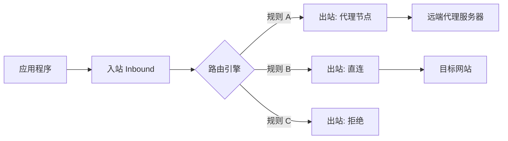
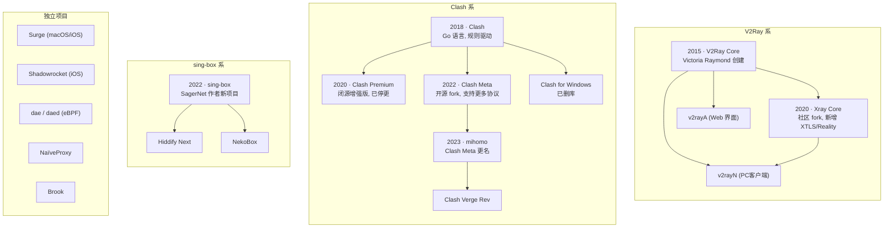

## 前言

在写好 [Linux 双系统安装指南]() 后, 我原本想按照**底层->中间件->高层**的顺序来规划文章, 结果在写**Bash, Csh 和 Zsh**的时候, 发现寸步难行, 因为读者没法科学上网, 很多必要的软件都下载不了, 因此还是先把科学上网的相关内容写好. 

---

## 什么是代理? 

顾名思义, 代理就是代替一个人去完成某个事情, 而在计算机领域中, 代理也是类似的道理: 代理服务器代替客户去访问某个特定域名, 以此规避某些限制, 或者获取某些资格. 

在这个过程中, 代理协议就是代理服务器和客户机的通信协议, 而代理软件则是基于这些协议开发出来的软件. 

---

## 代理协议

目前的代理协议主要分为传统代理协议和现代隧道协议. 后者相当于在增加了加密和混淆的隧道中跑传统代理. 

### 传统代理协议

1. **SOCKS5**

在 `OSI七层模型` 中, 这个协议**工作在会话层 (第五层)**, 不关心上层数据的内容. 客户端告诉代理服务器"我要连接某个 IP 的某个端口", 服务器建立连接后双向转发, 仅此而已. 它的特点是握手简单, 无加密, 无混淆. 但是所有现代代理软件都支持 `SOCKS5` 入站和出站, 是名副其实的通用接口. 

2. **HTTP Proxy**

这个协议**工作在应用层**, 只能代理 `HTTP/HTTPS` 流量. 处理 `HTTPS` 时用 `CONNECT` 方法建立隧道, 所以也叫做 `HTTP Tunnel`, 同样无加密. 

这两个协议只实现了基础的代理逻辑, 但是并没有增强流量转发过程中的安全性, 存在被劫持和数据泄露的风险. 因此才有后续隧道协议的诞生. 

### 现代隧道协议

这类协议基本都是在 `SOCKS5` 和 `HTTP Proxy` 外面包了一层加密和伪装. 它们具有两个核心设计目标: 

- 加密: 防止内容被识别. 
- 混淆: 伪装流量特征, 防止被识别和封锁. 

主要协议包括: 

1. **Shadowsocks (SS)**

特点是极简和高效. 客户端把原始数据用预共享密钥加密后直接发给服务端, 服务端解密后转发, 没有复杂的握手过程. 加密方式经历了多次迭代, 主流使用 `AEAD` 加密 (如 `aes-256-gcm`). 后来又出了 `Shadowsocks 2022` 版本, 引入了基于 `PSK` 的会话密钥, 进一步解决了重放攻击和主动探测的问题. 

2. **VMess (V2Ray 原生协议)**

`V2Ray` 项目的原生协议. 相比 `Shadowsocks`, 核心改进在于在数据传输前增加了认证环节: 客户端用一个基于时间的 `UUID` 生成请求头, 服务端能够验证请求的合法性, 不符合的直接丢弃. 支持 `AEAD` 加密和多路复用. 

3. **VLESS**

可以理解为去掉了内层加密的 `VMess`. `VLESS` 本身不负责加密, 而是把加密交给底层传输层 (`TLS / XTLS / Reality`) 来做, 避免双重加密带来的性能开销. 

4. **Trojan**

设计思路是拥抱标准 `TLS`, 把代理流量伪装成普通的 `HTTPS` 访问. 服务端看起来就是一个正常的 `HTTPS` 网站, 客户端用标准 `TLS` 连接, 在加密通道内传输代理数据. 外部无法区分这是代理流量还是正常的网页访问, 以此实现混淆. 

5. **Reality**

`Trojan` 的伪装依赖你自己的域名和 `TLS` 证书, 如果域名暴露了, 伪装就破了. `Reality` 更进一步: 在 `TLS` 握手时借用一个真实存在的知名网站 (比如微软、苹果) 的域名作为 `SNI`, 从外部看来这就是一个访问大厂网站的正常连接. 不需要自己购买域名和证书, 伪装程度更高. 

6. **Hysteria / Hysteria2**

基于 `QUIC (UDP)` 协议的代理. 核心优势在于弱网环境下的表现: 利用 `QUIC` 的多路复用和 `0-RTT` 特性, 在丢包严重的网络中比基于 `TCP` 的协议快很多. 代价是 `UDP/QUIC` 在某些网络环境下可能被限速或阻断. 

7. **TUIC**

同样基于 `QUIC`, 设计上比 `Hysteria` 更轻量. 已经停止独立维护, 其实现被吸收进了 `sing-box`. 

---

当然, 如果你只是正常使用, 不打算自建节点或者深入研究, 其实没有什么必要了解每个协议的细节──现在的代理软件基本都支持多种协议, 选哪个协议更多取决于你的节点提供商支持什么. 

协议演化的主线可以概括为: 

> 无加密 --> 对称加密 --> 认证 + 加密 --> TLS 伪装 --> 借用 TLS --> QUIC 优化弱网

## 代理软件

### 核心架构

现代代理软件几乎都遵循同一个数据流模型: 

其中三个核心组件: 

- 入站: 定义软件以什么方式接收流量. 常见的有本地 `SOCKS/HTTP` 监听 (需要应用主动设置代理) 和 `TUN` 虚拟网卡 (接管整个系统的流量, 无需逐个应用配置). 
- 路由引擎: 根据域名, IP, 进程名和端口等信息判断流量走哪个出站, 是实现**国内直连, 国外走代理**的关键. 
- 出站: 定义流量的出口与发送协议, 可以直连, 代理或者拒绝. 

不同软件的区别主要体现在: 配置格式, 支持的协议范围, 路由规则的表达能力, 以及是否支持策略组 (自动选择延迟最低的节点, 故障自动切换等). 

### 代理软件

代理软件不计其数, 但追溯源头, 主要是三个分支和若干个独立项目: 

简单说明各系的特点: 

**V2Ray 系 (Xray Core)**

- 配置格式为 `JSON`, 采用多入站/多出站/路由的架构. 
- `Xray` 是 `V2Ray` 的活跃 `fork`, 目前事实上已取代原版, 是 `VLESS + Reality` 的主要实现者. 
- 适合需要精细控制流量走向的场景, 但配置复杂, 手写 `JSON` 容易出错. 

**Clash 系 (mihomo)**

- 配置格式为 `YAML`, 核心概念是"策略组 + 规则". 策略组可以自动测速选最快节点, 也可以手动切换. 
- 原版 `Clash` 和 `Clash Premium` 已停更, 目前活跃的是 `mihomo` (原 `Clash Meta`). 
- 配置直观, 社区生态成熟, 有大量现成的规则集可以直接用. 

**sing-box 系**

- 配置格式为 `JSON`, 设计目标是融合 `V2Ray` 的灵活性和 `Clash` 的易用性. 
- 协议支持最全面: `Shadowsocks`, `VMess`, `VLESS`, `Trojan`, `Hysteria`, `TUIC`, `WireGuard`, `Reality` 全都原生支持. 
- 相对较新, 文档和中文教程还不如前两者丰富. 

**独立项目**

- `Surge` / `Shadowrocket`: Apple 生态下的成熟商业客户端. 
- `dae`: 基于 `eBPF` 的 Linux 透明代理, 性能极高, 适合路由器场景. 
- `NaïveProxy`: 复用 Chromium 网络栈, TLS 指纹和 Chrome 浏览器完全一致, 抗识别能力极强但部署复杂. 

### 内核能力对比

| 特性 | Xray Core | mihomo | sing-box |
|---|---|---|---|
| 配置格式 | `JSON` | `YAML` | `JSON` |
| 策略组 | 不原生支持 | 原生支持 | 支持 |
| VLESS + Reality | 支持 | 支持 | 支持 |
| Hysteria 2 | 不支持 | 支持 | 支持 |
| WireGuard 出站 | 支持 | 支持 | 支持 |
| TUN 模式 | 需外部工具 | 原生支持 | 原生支持 |

### GUI 客户端与内核的关系

很多人容易把 GUI 客户端和内核混为一谈. 实际上 GUI 客户端只是一层壳, 负责提供界面、解析订阅、管理配置, 真正干活的是底层内核. 

| GUI 客户端 | 底层内核 | 平台 |
|---|---|---|
| **v2rayN** | `Xray` | Windows / MacOS / Linux |
| **v2rayA** | `Xray` | 全平台 (Web) |
| **v2rayNG** | `Xray` | Android |
| **Clash Verge Rev** | `mihomo` | Windows / MacOS / Linux |
| **Hiddify Next** | `sing-box` | 全平台 |
| **NekoBox** | `Xray` 或 `sing-box` (可切换) | Windows / Linux |
| **Shadowrocket** | 自有实现 | iOS |
| **Stash** | `mihomo` 兼容 | iOS |

---

## 小结

这篇文章只做了一个总体的概括. **协议决定了数据怎么加密和伪装, 软件决定了流量怎么分流和管理, 而 GUI 客户端决定了你日常的使用体验**. 

我目前主要在 Linux 和 Windows 上使用 v2rayN 和 Clash Verge Rev, Android 上主要使用 v2rayNG 和 Clash Meta For Android, 相关的内容后续会逐步更新. 
