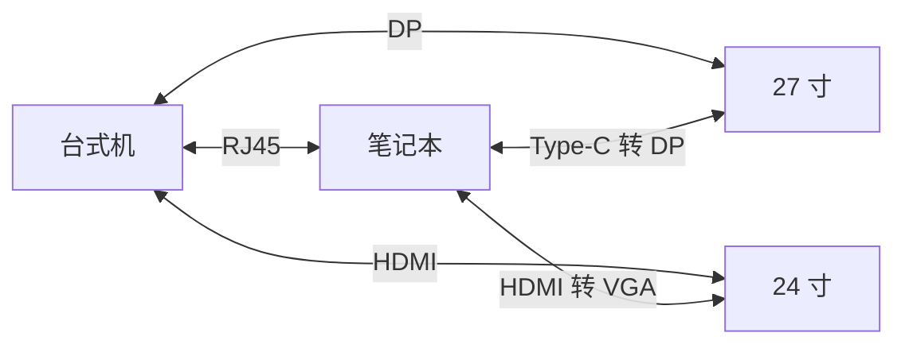
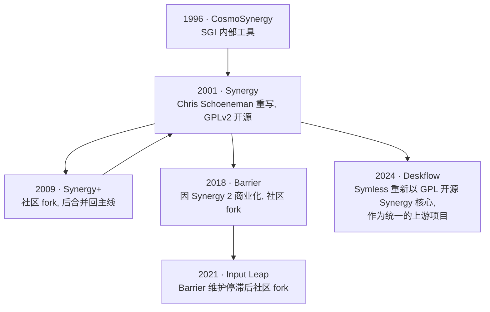

## 背景

由于工作原因, 目前使用一台笔记本进行户外部署与测试, 而台式机则留在工位上进行仿真与开发. 工位上有两台显示器, 于是产生了一个需求: **两台计算机共享显示器, 并且能在键鼠和文件传输上无缝切换**. 

这篇文章记录我最终的解决方案, 包括三个部分: 
- **键鼠共享**: 一套键盘鼠标同时控制两台计算机. 
- **显示器输入源切换**: 通过命令行或脚本切换显示器的视频输入, 不需要伸手按物理按键. 
- **文件共享**: 通过 RJ45 接口的网线在两台计算机之间共享文件. 

上述三个部分都支持 Windows 和 Ubuntu 双系统, 对于其他的 Linux 发行版也有一定的参考价值. 

---

## 硬件情况

我的硬件配置如下: 

| 设备 | CPU / 显卡 | 视频输出接口 |
|---|---|---|
| 台式机 | AMD R7 9700X / RTX 5060 Ti 16GB | DP×3 + HDMI×1 |
| ThinkBook 14 G7+ AHP | AMD Ryzen 7 H 255 / Radeon 780M | Type-C×2（DP Alt Mode）+ HDMI |

| 显示器 | 接口 |
|---|---|
| SANC G72 Max（27 寸） | DP×2 + HDMI×2 |
| HKC S24 Pro（24 寸） | HDMI×1 + VGA×1 |

连接方式如下: 



---

## 键鼠共享

### 显示协议区别

键鼠共享软件与你的桌面环境使用的显示协议有关. Wayland 对键鼠焦点捕捉的限制比 X11 严格得多, 很多在 X11 下能用的软件在 Wayland 下失灵. 

对于 Barrier, Input Leap 和 Deskflow 这几个软件, 我尝试后最终的结论是: 

- **X11 环境**: 三个软件都能使用. 
- **Wayland 环境**: 只有 Deskflow 能够正常工作. 

顺带一提, 这几个软件其实是一脉相承的: 



Deskflow 更接近原始 Synergy, 再加上是 Symless 官方维护, Wayland 适配走在了前面. 而 Barrier 和 Input Leap 已经有相当长一段时间没有更新. 

如果你不知道自己当前用的是哪种协议, 在终端中执行: 

```bash
echo $XDG_SESSION_TYPE
```

查看结果是 `wayland` 或 `x11` 即可. 

### 安装和配置

1. 安装: 只需要在 [GitHub release](https://github.com/deskflow/deskflow) 上下载安装包, 安装即可. 
2. 配置: 
    - 服务端: 新建虚拟屏幕, 配置相对关系, 记录右上角的**建议IP**, 点击启动. 
    - 客户端: 在**连接到**输入框中填入**建议IP**, 点击连接.

> 如果客户端连不上, 检查服务端的防火墙是否放行了 24800 端口 (Ubuntu: `sudo ufw allow 24800/tcp`, Windows 会有自动弹窗提示.)

## 显示器输入源切换

### DDC/CI 协议

前面已经接好了视频信号线, 已经能够正常使用, 只是每次切换主机时都需要伸手按物理按键, 比较麻烦. 我希望我的大部分操作可以不离开键鼠. 

**DDC/CI** (Display Data Channel / Command Interface) 协议能够解决这个问题. 简单来说, 这是一个让计算机通过视频接口中的 I<sup>2</sup>C 通信针脚直接控制显示器的协议, 让亮度, 对比度和输入源等信息都能从系统层面读写. 这是一个行业通用协议， 大多数显示器都支持, 不一定默认启用, 可以在显示器的 OSD 菜单中找一下"DDC/CI"开关. 

> **这里需要注意一个坑**: 
> 
> DDC/CI 依赖 I<sup>2</sup>C 信号透传. HDMI, DP, Type-C 都能正常透传 I<sup>2</sup>C, 唯独 **VGA 转接线不行**, 这是因为, VGA 接口里有 DDC 针脚，但廉价转接芯片普遍不会保留它. 所以在我的方案里，24 寸显示器走 VGA 接笔记本时，无法用 DDC/CI 控制, 只能在台式机这边用 DP 控制它. 
> 
> 扩展坞、HDMI 一分二转接线之类的设备同样普遍不透传 I<sup>2</sup>C. 

说完了原理, 下面分别说 Ubuntu 和 Windows 下的操作. 

### Ubuntu 系统

1. 安装与权限配置

```bash
# 安装 ddcutil
sudo apt update && sudo apt install ddcutil

# 加载 I2C 模块
sudo modprobe i2c-dev

# 将当前用户加入 I2C 用户组
sudo usermod -aG i2c $USER
```

执行完注销重新登录, 让用户组生效. 

2. 切换输入源

在 Ubuntu 系统上, 最终要执行的命令格式为: 

```bash
ddcutil --bus=<I2C 总线号> setvcp 60 <输入源代码>
```

需要的两个参数都可以从 `ddcutil` 自身查到. 

**第一步: 查询总线号**: 

```bash
ddcutil detect
``` 

输出类似: 

```
Display 1
   I2C bus:  /dev/i2c-7
   ...
   Mfg id:               HKC - HKC OVERSEAS LIMITED
   Model:                S24 PRO

Display 2
   I2C bus:  /dev/i2c-10
   ...
   Mfg id:               SAC - UNK
   Model:                G72 Max
```

每个显示器的 `I2C bus` 后面带着的数字 (这里是 7 和 10) 就是总线号.  

**第二步: 查询输入源代号**

在终端中执行: 

```bash
ddcutil --bus=<上一步的总线号> capabilities
```

在输出结果中寻找 `Feature: 60 (Input Source)`这一部分: 

```
Feature: 60 (Input Source)
   Values:
      11: HDMI-1
      12: HDMI-2
      0f: DisplayPort-1
      10: DisplayPort-2
```

下面列出来的就是这台显示器支持的输入源代号. 

**第三步: 拼接完整命令**

举个例子, 假设现在我要把 27寸显示器 (总线 10) 切到 DisplayPort-1: 

```bash
ddcutil --bus=10 setvcp 60 0x0f
```

#### 自动化脚本

每次手敲命令也很烦, 所以我  让 Gemini 3.1 Pro  写了个交互式脚本 `SmartSwitch`, 可以扫描所有显示器, 用颜色标注当前活跃的输入源, 记住每个端口接的是哪台主机, 并且一键切换. 

```bash
#!/bin/bash

# ==========================================
# SmartSwitch v3.0 — 带颜色状态标注的显示器输入源管理
# ==========================================
# 功能：
#   1. 🟢 绿色标注当前活跃输入源（自动检测）
#   2. 🟡 黄色标注已连接但未活跃的输入源（手动标记）
#   3. ⚪ 灰色标注未标记/未知状态的输入源
#   4. 一键切换输入源
#   5. 切换后自动验证
#
# 前置要求：sudo ddcutil detect 能扫描到显示器
# ==========================================

set -euo pipefail

# -------------------- 配置 --------------------
CONFIG_DIR="${HOME}/.config/smart-switch"
DEVICE_FILE="${CONFIG_DIR}/devices.conf"   # 记录哪些端口有设备

# 预定义输入源名称映射
declare -A SOURCE_MAP=(
    ["0x01"]="VGA-1"
    ["0x03"]="DVI-1"
    ["0x04"]="DVI-2"
    ["0x0f"]="DisplayPort-1"
    ["0x10"]="DisplayPort-2"
    ["0x11"]="HDMI-1"
    ["0x12"]="HDMI-2"
    ["0x1b"]="USB Type-C"
)

# -------------------- 颜色定义 --------------------
# 检测终端是否支持颜色（非管道/重定向时启用）
if [[ -t 1 ]]; then
    COLOR_GREEN='\033[0;32m'
    COLOR_YELLOW='\033[0;33m'
    COLOR_GRAY='\033[0;90m'
    COLOR_RED='\033[0;31m'       # 仅用于真正的错误/警告
    COLOR_BOLD='\033[1m'
    COLOR_RESET='\033[0m'
else
    # 输出到文件或管道时禁用颜色
    COLOR_GREEN=''
    COLOR_YELLOW=''
    COLOR_GRAY=''
    COLOR_RED=''
    COLOR_BOLD=''
    COLOR_RESET=''
fi

# 图标（如果终端不支持 Unicode，回退到 ASCII）
if [[ "${LC_ALL:-${LANG:-C}}" == *"UTF-8"* || "${LC_ALL:-${LANG:-C}}" == *"utf-8"* ]]; then
    ICON_ACTIVE="●"      # 活跃（实心圆）
    ICON_STANDBY="○"     # 待命（空心圆）
    ICON_OFF="·"         # 未连接（小点）
else
    ICON_ACTIVE="*"
    ICON_STANDBY="o"
    ICON_OFF="."
fi

# -------------------- 工具函数 --------------------

to_lower() {
    echo "$1" | tr '[:upper:]' '[:lower:]'
}

ensure_config_dir() {
    if [[ ! -d "$CONFIG_DIR" ]]; then
        mkdir -p "$CONFIG_DIR"
    fi
    if [[ ! -f "$DEVICE_FILE" ]]; then
        cat > "$DEVICE_FILE" <<'EOF'
# ===========================================
# SmartSwitch — 已连接设备标记
# ===========================================
# 格式: BUS|HEX_CODE=设备名称
#
# 示例:
#   7|0x0f=我的台式机
#   7|0x11=Surface Laptop
#   10|0x11=Surface Laptop
#
# 标记后的端口在非活跃时会显示为黄色（待命状态）
# 删除某行即可取消标记
# ===========================================
EOF
    fi
}

# 获取设备标记
get_device_label() {
    local bus="$1"
    local vcp="$2"
    local key="${bus}|$(to_lower "$vcp")"
    local result=""
    while IFS='=' read -r k v; do
        [[ "$k" =~ ^[[:space:]]*# ]] && continue
        k=$(echo "$k" | xargs)
        [[ -z "$k" ]] && continue
        if [[ "$k" == "$key" ]]; then
            result="$v"
            break
        fi
    done < "$DEVICE_FILE" 2>/dev/null
    echo "$result"
    [[ -n "$result" ]] || true
}

# 检查端口是否已被标记（返回 0=已标记, 1=未标记）
is_port_marked() {
    local bus="$1"
    local vcp="$2"
    local key="${bus}|$(to_lower "$vcp")"
    local escaped_key="${key//./\\.}"
    if grep -q "^${escaped_key}=" "$DEVICE_FILE" 2>/dev/null; then
        return 0
    else
        return 1
    fi
}

# 读取当前活跃输入源（返回 16 进制字符串如 0x0f）
get_current_source() {
    local bus="$1"
    local terse_output
    terse_output=$(ddcutil --bus="$bus" getvcp 60 --terse 2>/dev/null || true)

    if [[ -z "$terse_output" ]]; then
        echo ""
        return
    fi

    # terse 格式: "VCP 60 <flags> <value>"  value 以 x 开头表示16进制 (如 x0f)
    local hex_val
    hex_val=$(echo "$terse_output" | awk '/^VCP 60 / {print $NF}')
    if [[ -n "$hex_val" && "$hex_val" =~ ^x[0-9a-fA-F]+$ ]]; then
        echo "0x${hex_val#x}"
    else
        echo ""
    fi
}

# 标记/取消标记设备
toggle_device_mark() {
    local bus="$1"
    local vcp="$2"
    local key="${bus}|$(to_lower "$vcp")"
    local escaped_key="${key//./\\.}"
    local current_label
    current_label=$(get_device_label "$bus" "$vcp")
    local port_name=${SOURCE_MAP[$(to_lower "$vcp")]:-"未知接口"}

    echo ""
    echo "━━━ 标记设备 ━━━"
    echo "端口: ${port_name} (${vcp})"

    if [[ -n "$current_label" ]]; then
        echo "当前标记: [${current_label}]"
        echo ""
        echo "  1. 修改标记"
        echo "  2. 删除标记（端口将变为灰色）"
        echo "  0. 取消"
        read -rp "👉 选择: " action
        case "$action" in
            1)
                read -rp "输入新名称: " new_label
                sed -i "/^${escaped_key}=/d" "$DEVICE_FILE"
                if [[ -n "$new_label" ]]; then
                    echo "${key}=${new_label}" >> "$DEVICE_FILE"
                    echo "✅ 已更新: ${new_label}"
                fi
                ;;
            2)
                sed -i "/^${escaped_key}=/d" "$DEVICE_FILE"
                echo "✅ 已删除标记（端口状态变为灰色）"
                ;;
            *) ;;
        esac
    else
        echo "当前状态: ⚪ 未标记（灰色）"
        echo ""
        read -rp "输入设备名称以标记此端口（如: 台式机）: " new_label
        if [[ -n "$new_label" ]]; then
            echo "${key}=${new_label}" >> "$DEVICE_FILE"
            echo "✅ 已标记: ${new_label}（端口状态变为黄色）"
        fi
    fi
}

# 打印带颜色的输入源条目
print_source_entry() {
    local index="$1"
    local vcp="$2"
    local bus="$3"
    local current_source="$4"

    local port_name=${SOURCE_MAP[$(to_lower "$vcp")]:-"未知接口"}

    local color=""
    local icon=""
    local suffix=""

    if [[ "$vcp" == "$current_source" ]]; then
        color="$COLOR_GREEN"
        icon="$ICON_ACTIVE"
        suffix=" ← 当前活跃"
    elif is_port_marked "$bus" "$vcp"; then
        color="$COLOR_YELLOW"
        icon="$ICON_STANDBY"
        local device_label
        device_label=$(get_device_label "$bus" "$vcp")
        suffix="  [${device_label}]"
    else
        color="$COLOR_GRAY"
        icon="$ICON_OFF"
    fi

    printf "${color}%s. %s %s (%s)%s${COLOR_RESET}\n" \
        "$index" "$icon" "$port_name" "$vcp" "$suffix"
}

# -------------------- 主循环 --------------------
ensure_config_dir

# 首次运行提示
if [[ ! -s "$DEVICE_FILE" ]] || ! grep -v '^#' "$DEVICE_FILE" | grep -q '[^[:space:]]'; then
    echo ""
    echo -e "${COLOR_BOLD}💡 提示:${COLOR_RESET} 这是首次运行。"
    echo "   脚本可以自动检测当前活跃的输入源（绿色），"
    echo "   但需要你手动标记哪些端口连接了设备（黄色）。"
    echo "   进入菜单后选择「🏷️ 标记设备」即可。"
    echo ""
    read -rp "按<Enter>键继续..."
fi

while true; do
    clear
    echo "=========================================="
    echo "    SmartSwitch v3.0 — 输入源状态管理"
    echo "=========================================="
    echo "🟢 活跃  🟡 待命  ⚪ 未连接"
    echo "=========================================="
    echo "正在扫描 I2C 总线..."

    # 扫描显示器
    scan_result=$(ddcutil detect -t 2>/dev/null || true)
    declare -a buses=()
    declare -a models=()

    in_valid_display=false
    while IFS= read -r line; do
        line="${line#"${line%%[![:space:]]*}"}"
        if [[ "$line" == "Display "* && "$line" != "Invalid display" ]]; then
            in_valid_display=true
            continue
        elif [[ "$line" == "Invalid display" ]]; then
            in_valid_display=false
            continue
        fi
        [[ "$in_valid_display" != true ]] && continue
        if [[ "$line" == "I2C bus:"* ]]; then
            bus_path="${line##* }"
            bus_num="${bus_path##*-}"
            buses+=("$bus_num")
        elif [[ "$line" == "Monitor:"* ]]; then
            mon_str=$(echo "$line" | sed -E 's/^Monitor:[[:space:]]+//')
            mon_model=$(echo "$mon_str" | cut -d':' -f2)
            models+=("$mon_model")
        fi
    done <<< "$scan_result"

    if [[ ${#buses[@]} -eq 0 ]]; then
        echo ""
        echo -e "${COLOR_RED}❌ 未检测到支持 DDC/CI 的显示器。${COLOR_RESET}"
        echo ""
        echo "排查建议:"
        echo "  1. 执行: sudo ddcutil detect"
        echo "  2. 检查显示器 OSD 菜单中 DDC/CI 是否开启"
        echo "  3. 是否使用了 DisplayLink 扩展坞？"
        exit 1
    fi

    # --- 显示器选择 ---
    while true; do
        echo ""
        echo "==== 可用的显示器 ===="
        for i in "${!buses[@]}"; do
            echo "$((i + 1)). ${models[$i]} (Bus: ${buses[$i]})"
        done
        echo "0. 退出脚本"
        echo "------------------------"
        read -rp "👉 选择显示器 (0-${#buses[@]}): " monitor_choice

        if [[ "$monitor_choice" == "0" ]]; then
            echo "👋 再见！"
            exit 0
        elif ! [[ "$monitor_choice" =~ ^[0-9]+$ ]] || \
             [[ "$monitor_choice" -lt 0 ]] || \
             [[ "$monitor_choice" -gt "${#buses[@]}" ]]; then
            echo "⚠️ 输入错误！"
        else
            break
        fi
    done

    selected_bus=${buses[$((monitor_choice - 1))]}
    selected_model=${models[$((monitor_choice - 1))]}

    # --- 获取能力列表 ---
    echo ""
    echo "🔍 正在读取 [${selected_model}] 的能力信息..."

    raw_caps=$(ddcutil --bus="$selected_bus" capabilities 2>/dev/null || true)

    # 提取 Feature 60 区块
    feature_60_block=$(echo "$raw_caps" | awk '
        /Feature: 60/ { flag=1; print; next }
        /Feature:/    { if(flag) exit }
        flag
    ')

    declare -a valid_vcps=()
    if [[ -n "$feature_60_block" ]]; then
        while read -r hex_code; do
            if [[ -n "$hex_code" && "$hex_code" != "0x00" ]]; then
                valid_vcps+=("$(to_lower "$hex_code")")
            fi
        done < <(echo "$feature_60_block" | awk -F: '
            /^[[:space:]]+[0-9a-fA-F]{2}:/ {
                gsub(/^[ \t]+/, "", $1)
                print "0x"$1
            }
        ')
    fi

    # --- 获取当前活跃输入源 ---
    current_source=$(get_current_source "$selected_bus")

    # --- 输入源操作循环 ---
    while true; do
        echo ""
        echo "==== [${selected_model}] 输入源状态 ===="
        echo ""

        # 打印图例
        echo -e "  ${COLOR_GREEN}${ICON_ACTIVE} 绿色${COLOR_RESET} = 当前活跃   ${COLOR_YELLOW}${ICON_STANDBY} 黄色${COLOR_RESET} = 已连接待命   ${COLOR_GRAY}${ICON_OFF} 灰色${COLOR_RESET} = 未标记"
        echo "  ─────────────────────────────────────"

        # 打印每个输入源
        option_index=1
        if [[ ${#valid_vcps[@]} -gt 0 ]]; then
            for vcp in "${valid_vcps[@]}"; do
                print_source_entry "$option_index" "$vcp" "$selected_bus" "$current_source"
                ((option_index++))
            done
        else
            echo -e "  ${COLOR_RED}⚠️ 无法获取此显示器的输入源列表${COLOR_RESET}"
        fi

        echo "  ─────────────────────────────────────"
        switch_opt=$option_index
        echo "${switch_opt}. 🔄 切换输入源"
        mark_opt=$((option_index + 1))
        echo "${mark_opt}. 🏷️  标记/取消标记设备"
        refresh_opt=$((option_index + 2))
        echo "${refresh_opt}. 🔃 刷新状态"
        return_opt=$((option_index + 3))
        echo "${return_opt}. 🔙 返回显示器列表"
        echo "0. ❌ 退出脚本"
        echo "------------------------"

        read -rp "👉 选择操作 (0-${return_opt}): " action_choice

        # --- 处理选择 ---
        if [[ "$action_choice" == "0" ]]; then
            echo "👋 再见！"
            exit 0
        elif [[ "$action_choice" == "$return_opt" ]]; then
            break
        elif [[ "$action_choice" == "$refresh_opt" ]]; then
            # 刷新：重新获取当前活跃源
            current_source=$(get_current_source "$selected_bus")
            echo "✅ 状态已刷新"
            continue
        elif [[ "$action_choice" == "$mark_opt" ]]; then
            # 标记设备子菜单
            echo ""
            echo "--- 选择要标记的端口 ---"
            for i in "${!valid_vcps[@]}"; do
                vcp=${valid_vcps[$i]}
                name=${SOURCE_MAP[$(to_lower "$vcp")]:-"未知接口"}
                label=$(get_device_label "$selected_bus" "$vcp")
                if [[ -n "$label" ]]; then
                    echo "$((i + 1)). ${name} (${vcp}) → 已标记: ${label}"
                else
                    echo "$((i + 1)). ${name} (${vcp}) → 未标记"
                fi
            done
            echo "0. 返回"
            read -rp "选择: " mark_choice
            if [[ "$mark_choice" =~ ^[0-9]+$ ]] && \
               [[ "$mark_choice" -ge 1 ]] && \
               [[ "$mark_choice" -le "${#valid_vcps[@]}" ]]; then
                toggle_device_mark "$selected_bus" "${valid_vcps[$((mark_choice - 1))]}"
                current_source=$(get_current_source "$selected_bus")
            fi
            continue
        elif [[ "$action_choice" == "$switch_opt" ]]; then
            # 切换输入源子菜单
            echo ""
            echo "--- 切换到哪个输入源？---"
            for i in "${!valid_vcps[@]}"; do
                vcp=${valid_vcps[$i]}
                name=${SOURCE_MAP[$(to_lower "$vcp")]:-"未知接口"}
                label=$(get_device_label "$selected_bus" "$vcp")
                if [[ "$vcp" == "$current_source" ]]; then
                    echo "$((i + 1)). ${name} (${vcp}) ← 当前活跃"
                elif [[ -n "$label" ]]; then
                    echo "$((i + 1)). ${name} (${vcp}) [${label}]"
                else
                    echo "$((i + 1)). ${name} (${vcp})"
                fi
            done
            echo "$((${#valid_vcps[@]} + 1)). ✍️  手动输入代码"
            echo "0. 取消"
            read -rp "选择: " switch_choice

            target_vcp=""
            if [[ "$switch_choice" == "0" ]]; then
                continue
            elif [[ "$switch_choice" =~ ^[0-9]+$ ]] && \
                 [[ "$switch_choice" -ge 1 ]] && \
                 [[ "$switch_choice" -le "${#valid_vcps[@]}" ]]; then
                target_vcp=${valid_vcps[$((switch_choice - 1))]}
            elif [[ "$switch_choice" -eq "$((${#valid_vcps[@]} + 1))" ]]; then
                read -rp "输入 16 进制代码 (如 0x11): " target_vcp
                target_vcp=$(to_lower "$target_vcp")
            else
                echo "⚠️ 无效选择"
                continue
            fi

            # 执行切换
            if [[ "$target_vcp" == "$current_source" ]]; then
                echo "⚠️ 该输入源已是当前活跃状态，无需切换。"
                read -rp "按<Enter>键继续..." -n 1 -s
                continue
            fi

            target_name=${SOURCE_MAP[$(to_lower "$target_vcp")]:-"未知接口"}
            target_label=$(get_device_label "$selected_bus" "$target_vcp")
            if [[ -n "$target_label" ]]; then
                target_display="${target_label} (${target_name})"
            else
                target_display="${target_name}"
            fi

            echo ""
            echo "🚀 正在切换到: ${target_display} (${target_vcp})..."
            echo "   执行: ddcutil --bus=${selected_bus} setvcp 60 ${target_vcp}"

            if ddcutil --bus="$selected_bus" setvcp 60 "$target_vcp" > /dev/null 2>&1; then
                sleep 0.5
                new_source=$(get_current_source "$selected_bus")
                if [[ "$new_source" == "$target_vcp" ]]; then
                    echo -e "${COLOR_GREEN}✅ 切换成功！${COLOR_RESET}"
                    current_source="$new_source"
                else
                    echo "⚠️  指令已发送，验证读取为 ${new_source}（预期 ${target_vcp}）"
                    echo "   如果画面已切换，可忽略（可能是响应延迟）。"
                    current_source=$(get_current_source "$selected_bus")
                fi
            else
                echo -e "${COLOR_RED}❌ 切换失败！${COLOR_RESET}"
                echo "   请检查：权限、DDC/CI 开关、显示器休眠状态"
            fi

            echo ""
            read -rp "按<Enter>键继续..." -n 1 -s
        else
            echo "⚠️ 输入错误，请重新选择！"
        fi
    done
done
```

### Windows系统

在 Windows 系统下, 可以使用 NirSoft 出品的 [ControlMyMonitor](https://www.nirsoft.net/utils/control_my_monitor.html) 软件进行检测与切换. 这个软件是免安装的图形界面 (GUI) 程序. 

打开之后会列出当前显示器的所有 VCP 控制项, 找到 `VCP Code = 60` 的一行, 双击修改当前值, 输入对应的输入源代码 (和 Ubuntu 下查到的代码一致, 没有 `0x` 十六进制前缀) 即可切换. 

> 由于这个软件本身就是图形界面, 操作直观, 我没有给它编写脚本. 

## 文件共享

两台计算机的位置非常接近, 直接用一根网线对连传文件, 比走无线快得多, 也不依赖路由器. 

### 网络配置

直连之后两台计算机不在一个由 DHCP 服务器管理的网段里, 需要手动设置静态 IP. 我的方案是把两台计算机放到 `192.168.10.0/24` 这个段里: 

| 计算机 | IP | 子网掩码 |
|---|---|---|
| 台式机 | 192.168.10.1 | 255.255.255.0 |
| 笔记本 | 192.168.10.2 | 255.255.255.0 |

> 笔记本如果没有 RJ45 接口, 可以使用 Type-C 转 RJ45 的转接器. 

#### Ubuntu 

Gnome 桌面环境下打开 `设置 → 网络 → 有线`, 点击齿轮按钮, 在 IPv4 选项卡里把方法改为"手动", 填入对应的地址和子网掩码即可. KDE 也是类似操作. 

#### Windows

`设置 → 网络和 Internet → 以太网 → IP 分配 → 编辑`, 选择"手动", 启用 IPv4 后填入对应的地址和子网掩码. 

配置完成后, 在两台计算机上互相 `ping` 一下对方的 IP, 确认能通. 

### 可能情况

由于两台计算机是 Windows + Ubuntu 双系统, 需要兼容性比较强的共享协议── **SMB** (Windows 原生支持, Linux 通过 Samba 支持). 下面分几种情况说明: 

- **情况一**: Windows 共享文件夹. 
- **情况二**: Ubuntu 共享文件夹. 
- **情况三**: Windows 访问共享文件夹. 
- **情况四**: Ubuntu 访问共享文件夹. 

按需配置即可. 

### 情况一: Windows 共享

1. 右键想共享的文件夹 → `属性 → 共享 → 高级共享`, 勾选"共享此文件夹", 点击"权限"按钮设置访问权限. 
2. 打开 `控制面板 → 网络和共享中心 → 高级共享设置`, 在当前网络配置文件下启用"网络发现"和"文件和打印机共享". 
3. 防火墙放行 SMB: 进入 `Windows 安全中心 → 防火墙和网络保护 → 允许应用通过防火墙`, 确认"文件和打印机共享"在当前网络下被勾选. 

### 情况二: Ubuntu 共享

1. 安装Samba

```bash
sudo apt update && sudo apt install samba
```

2. 修改配置文件

编辑 `/etc/samba/smb.conf`, 在文件末尾追加: 

```ini
[share]
   # 需要保证共享文件夹存在
   path = /home/<你的用户名>/<共享文件夹>
   browseable = yes
   read only = no
   guest ok = no
   valid users = <你的用户名>
```

3. 为该用户设置 Samba 密码 (和系统密码独立): 

```bash
sudo smbpasswd -a <你的用户名>
```

4. 重启服务

```bash
sudo systemctl restart smbd
```

5. 开放防火墙端口

如果系统启用了 `ufw`, 放行 Samba: 

```bash
sudo ufw allow samba
```

### 情况三: Windows 访问

按 `Win + R` 输入: 

```
\\192.168.10.2\share
```

弹窗中输入 Ubuntu 的用户名和刚才设置的 Samba 密码即可. 也可以右键"映射网络驱动器", 把它挂成本地盘符方便日常使用. 

### 情况四: Ubuntu 访问

打开文件管理器, 在地址栏输入: 

```
smb://192.168.10.1/共享文件夹名
```

首次访问会要求输入 Windows 这一端的用户名和密码, 输入即可. 勾选"永久记住"可以避免下次重复输入. 

如果想从命令行访问, 可以安装 `cifs-utils` 后挂载: 

```bash
sudo apt install cifs-utils
sudo mkdir -p /mnt/win-share
sudo mount -t cifs //192.168.10.1/共享文件夹名 /mnt/win-share \
    -o username=<Windows 用户名>,uid=$(id -u),gid=$(id -g)


```

---

## 小结

到这里, 键鼠, 显示器, 文件三个部分都打通了. 尽管还存在或多或少的体验问题, 但这确实是我目前能够找到的最优方案. 
