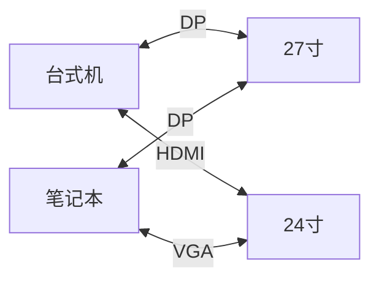

## 键鼠共享

显示协议不同, 软件的支持情况也不同, Wayland 对键鼠焦点捕捉的限制更为严格, 有些在 X11 协议下能够正常工作的软件在 Wayland 协议下却没办法正常工作. 

我也是尝试了相当多的软件, 最终才找到了目前使用的 Deskflow. 

X11协议下: Barrier或Input Leap

Wayland协议下: Deskflow

## 显示协议切换

由于工作原因, 我目前需要使用一台笔记本进行户外部署与测试, 而台式机则留在工位上进行仿真与开发, 工位上又有两台显示器, 因此产生了将两台显示器分别外接到两台计算机上的需求. 

### 硬件情况

我的硬件配置与协议支持情况如下: 

|计算机|CPU|显卡|视频信号接口|支持协议|
|---|---|---|---|---|
|台式机|AMD R7 9700X|RTX 5060 Ti 16GB|DP*3+HDMI*1|DP, HDMI|
|ThinkBook 14+ 2024|AMD R7 H255| Redaon 780M(核显)|Type-C*2, HDMI|DP2.1, DP1.4, HDMI|


|显示器型号|接口|协议|
|---|---|---|
|SANC G72MAX| DP*2, HDMI*2|DP, HDMI|
|HKC S24 PRO| HDMI*1, VGA*1|HDMI, VGA|



一般情况下只要将接口接上就能正常使用, 但由于DP协议是握手形式, 而非 HDMI 或者 VGA 的广播形式, 所以一开始以为笔记本的多功能 Type-C 接口是虚假宣传XD, 后来重新插拔了一下才能正常工作. 

其实到这一步为止, 只要将硬件接口插好, 每次都手动更改视频信号输入源就行. 但我很贪心, 我希望我每天的大部分工作双手不用离开键盘鼠标就能完成. 

### DDC/CI 协议

`DDC/CI` 协议能够做到, 简单来说, 这个协议是从系统层面对显示器控制器输出信号, 切换视频信号输入源.

这个协议基于I2C通信针脚进行, 而平价的`HDMI->VGA`转接芯片不会保留I2C通信控制信号, 所以

在Windows系统上, 可以使用ComtroleMyMonitor软件读取VCP协议, 而在Ubuntu或者其他Linux发行版上, 可以使用ddcutil工具读取. 

所以对于我的双主机双系统双显示器而言, 需要记录的参数如下: 

|计算机|系统|显示器|软件/工具|总线|VCP代码|值|
|---|---|---|---|---|---|---|
|台式机|Windows|27寸|ControlMyMonitor|-|60||
|台式机|Ubuntu|27寸|ddcutil|10|60|0x0f|
|台式机|Windows|24寸|ControlMyMonitor||60||
|台式机|Ubuntu|24寸|ddcutil|7|60|03|
|笔记本|Windows|27寸|ControlMyMonitor||60||
|笔记本|Ubuntu|27寸|ddcutil|17|60|0x10|
|笔记本|Windows|24寸|ControlMyMonitor|---|60|---|
|笔记本|Ubuntu|24寸|ddcutil|7|60|01|

#### Ubuntu 系统

1. 前置准备步骤

```bash
sudo apt update && sudo apt install ddcutil
sudo modprobe i2c-dev
sudo usermod -aG i2c $USER
```

然后注销重新登录

2. 收集参数

在 Ubuntu 系统上, 最终执行更改VCP信号输入源的命令为: `ddcutil --bus=[i] setvcp 60 [j]`.

这个命令中, 其实只有两个参数需要注意, 也就是总线的编号 `[i]` 和 显示控制器输入源 `[j]`, 而其他部分不管在哪个计算机上都保持一致


- 第一个参数: 
    在终端中执行`ddcutil detect`命令, 可以看到类似下面的结果: 

```
Display 1
   I2C bus:  /dev/i2c-7
   DRM_connector:           card1-HDMI-A-2
   EDID synopsis:
      Mfg id:               HKC - HKC OVERSEAS LIMITED
      Model:                S24 PRO
      Product code:         9239  (0x2417)
      Serial number:        0000000000001
      Binary serial number: 1 (0x00000001)
      Manufacture year:     2024,  Week: 10
   VCP version:         2.1

Display 2
   I2C bus:  /dev/i2c-10
   DRM_connector:           card1-DP-4
   EDID synopsis:
      Mfg id:               SAC - UNK
      Model:                G72 Max
      Product code:         10083  (0x2763)
      Serial number:        0000000000000
      Binary serial number: 0 (0x00000000)
      Manufacture year:     2025,  Week: 1
   VCP version:         2.1
```

其中, 需要注意的点是I2C的总线号(`I2C bus`), 位于每个部分的第一行, 在下一步需要使用. 

- 第二个参数: 
    在终端中执行`ddcutil --bus=[i] capabilities`, 会获得类似下面的结果: 

```
Model: Not specified
MCCS version: 2.1
VCP Features:
   Feature: 02 (New control value)
   Feature: 04 (Restore factory defaults)
   Feature: 05 (Restore factory brightness/contrast defaults)
   Feature: 08 (Restore color defaults)
   Feature: 10 (Brightness)
   Feature: 12 (Contrast)
   Feature: 14 (Select color preset)
      Values:
         05: 6500 K
         06: 7500 K
         08: 9300 K
         0b: User 1
   Feature: 16 (Video gain: Red)
   Feature: 18 (Video gain: Green)
   Feature: 1A (Video gain: Blue)
   Feature: 52 (Active control)
   Feature: 60 (Input Source)
      Values:
         00: Unrecognized value
         11: HDMI-1
         12: HDMI-2
         0f: DisplayPort-1
         10: DisplayPort-2
   Feature: AA (Screen Orientation)
      Values:
         01: 0 degrees
         02: 90 degrees
   Feature: 62 (Audio speaker volume)
   Feature: AC (Horizontal frequency)
   Feature: AE (Vertical frequency)
   Feature: B2 (Flat panel sub-pixel layout)
   Feature: B6 (Display technology type)
   Feature: C6 (Application enable key)
   Feature: C8 (Display controller type)
   Feature: C9 (Display firmware level)
   Feature: CC (OSD Language)
      Values:
         02: English
         0d: Chinese (simplified / Kantai)
         07: Korean
         09: Russian
         0a: Spanish
         06: Japanese
         03: French
   Feature: D6 (Power mode)
      Values:
         01: DPM: On,  DPMS: Off
         04: DPM: Off, DPMS: Off
         05: Write only value to turn off display
   Feature: DF (VCP Version)
   Feature: FD (Manufacturer specific feature)
```

找到`Feature: 60 (Input Source)`这一行, 下面的就是屏幕控制器中的视频信号输入源. 

这样子就获得了两个参数, 我们只要在终端中输入完整的命令就可以实现视频信号的切换.

假设我们在 `dccutil detect` 中获得的 `I2C bus` 为7, 在 `dccutil --bus=7 capabilities` 中获得的VCP代码60值为 `0f`, 那么最终对应的指令则为 `dccutil --bus=7 setvcp 60 0x0f`.

**如果读者想要使用自动化脚本的话**, 可以在完成安装`ddcutil`并加载驱动后使用下面的脚本: 

```bash
#!/bin/bash

# ==========================================
# 通用显示器输入源智能切换脚本 (基于 ddcutil)
# 修复了多行 capabilities 数据的解析问题
# ==========================================

# 预定义常见的 16进制代码字典，用于将代码翻译成人类可读的名称
declare -A SOURCE_MAP=(
  ["0x01"]="VGA"
  ["0x03"]="DVI"
  ["0x04"]="DVI 2"
  ["0x0f"]="DisplayPort 1"
  ["0x10"]="DisplayPort 2"
  ["0x11"]="HDMI 1"
  ["0x12"]="HDMI 2"
  ["0x1b"]="Type-C"
)

# 转换小写，保证匹配
function to_lower() {
  echo "$1" | tr '[:upper:]' '[:lower:]'
}

while true; do
  clear
  echo "===================================="
  echo "      显示器输入源控制台"
  echo "===================================="
  echo "正在扫描 I2C 总线，请稍候..."

  # 扫描显示器
  scan_result=$(ddcutil detect -t 2>/dev/null)
  declare -a buses=()
  declare -a models=()

  # 解析 detect -t 输出
  while IFS= read -r line; do
    line="${line#"${line%%[![:space:]]*}"}"

    if [[ "$line" == "I2C bus:"* ]]; then
      bus_path="${line##* }"
      bus_num="${bus_path##*-}"
      buses+=("$bus_num")
    elif [[ "$line" == "Monitor:"* ]]; then
      mon_str=$(echo "$line" | sed -E 's/^Monitor:[[:space:]]+//')
      mon_model=$(echo "$mon_str" | cut -d':' -f2)
      models+=("$mon_model")
    fi
  done <<<"$scan_result"

  if [ ${#buses[@]} -eq 0 ]; then
    echo "❌ 未检测到支持 DDC/CI 的显示器。"
    exit 1
  fi

  # --- 显示器选择循环 ---
  while true; do
    echo ""
    echo "==== 可用的显示器 ===="
    for i in "${!buses[@]}"; do
      echo "$((i + 1)). ${models[$i]} (Bus: ${buses[$i]})"
    done
    echo "0. 退出脚本"
    echo "------------------------"
    read -p "👉 请选择操作对象 (0-${#buses[@]}): " monitor_choice

    if [[ "$monitor_choice" == "0" ]]; then
      echo "👋 退出脚本，再见！"
      exit 0
    elif ! [[ "$monitor_choice" =~ ^[0-9]+$ ]] || [ "$monitor_choice" -lt 0 ] || [ "$monitor_choice" -gt "${#buses[@]}" ]; then
      echo "⚠️ 输入错误，请重新输入正确的序号！"
    else
      break
    fi
  done

  selected_bus=${buses[$((monitor_choice - 1))]}
  selected_model=${models[$((monitor_choice - 1))]}

  # --- 获取该显示器的 VCP 60 支持列表 ---
  echo ""
  echo "🔍 正在从 [$selected_model] 的 MCU 中提取支持的视频接口，可能需要几秒钟..."

  raw_caps=$(ddcutil --bus="$selected_bus" capabilities 2>/dev/null)

  # ====== 核心修复：多行区块提取 ======
  # 1. 使用 awk 提取从 "Feature: 60" 开始到下一个 "Feature:" 结束的文本块
  feature_60_block=$(echo "$raw_caps" | awk '/Feature: 60/{flag=1; print; next} /Feature:/{if(flag) exit} flag')

  # 2. 从区块中提取出类似 "11:" 前面的数字，加上 0x 前缀
  declare -a valid_vcps=()
  if [[ -n "$feature_60_block" ]]; then
    # 查找带有冒号的行 (如 "  11: HDMI-1")，提取并格式化为 0x11
    while read -r hex_code; do
      # 过滤空值和 0x00(无效值)
      if [[ -n "$hex_code" && "$hex_code" != "0x00" ]]; then
        valid_vcps+=("$(to_lower "$hex_code")")
      fi
    done < <(echo "$feature_60_block" | awk -F: '/^[[:space:]]+[0-9a-fA-F]{2}:/{gsub(/^[ \t]+/, "", $1); print "0x"$1}')
  fi
  # ==================================

  # --- 信号源选择循环 ---
  while true; do
    echo ""
    echo "==== [$selected_model] 支持的输入源 ===="

    option_index=1
    if [ ${#valid_vcps[@]} -gt 0 ]; then
      for vcp in "${valid_vcps[@]}"; do
        name=${SOURCE_MAP[$vcp]:-"未知接口"}
        echo "${option_index}. ${name} (${vcp})"
        ((option_index++))
      done
    else
      echo "⚠️ 无法自动获取此显示器的能力列表，请使用手动输入。"
    fi

    manual_opt=$option_index
    echo "${manual_opt}. ✍️  手动输入 16 进制代码 (如 0x11)"
    return_opt=$((option_index + 1))
    echo "${return_opt}. 🔙 返回上级菜单"
    echo "0. ❌ 退出脚本"
    echo "------------------------"

    read -p "👉 请选择输入源 (0-${return_opt}): " source_choice

    if [[ "$source_choice" == "0" ]]; then
      echo "👋 退出脚本，再见！"
      exit 0
    elif [[ "$source_choice" == "$return_opt" ]]; then
      break
    elif [[ "$source_choice" == "$manual_opt" ]]; then
      read -p "请输入 16 进制代码 (例如 0x11): " target_vcp
      target_vcp=$(to_lower "$target_vcp")
      break
    elif ! [[ "$source_choice" =~ ^[0-9]+$ ]] || [ "$source_choice" -lt 1 ] || [ "$source_choice" -ge "$manual_opt" ]; then
      echo "⚠️ 输入错误，请重新选择！"
    else
      target_vcp=${valid_vcps[$((source_choice - 1))]}
      break
    fi
  done

  if [[ "$source_choice" == "$return_opt" ]]; then
    continue
  fi

  # --- 执行发送指令 ---
  echo ""
  echo "🚀 发送指令: ddcutil --bus=$selected_bus setvcp 60 $target_vcp"
  ddcutil --bus="$selected_bus" setvcp 60 "$target_vcp" >/dev/null 2>&1

  echo "✅ 指令已送达！(注意：如果此时画面切走，终端可能会卡住几秒)"
  echo "按任意键返回主菜单，或按 Ctrl+C 退出..."
  read -n 1 -s
done
```

#### Windows系统

在 Windows 系统下, 可以通过 ControlMyMonitor 软件进行检测与切换. 

下载 ControlMyMonitor, 安装后打开, 查看 `VCP Code` 为58的那一行, 双击尝试修改数值, 直到成功切换为你想要切换的另一台显示器. 以上就是这个软件的使用方法. 

> 由于这个软件本身就是 GUI 程序, 使用方法非常简单, 我就不打算为它编写脚本了. 
