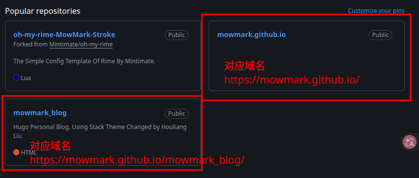
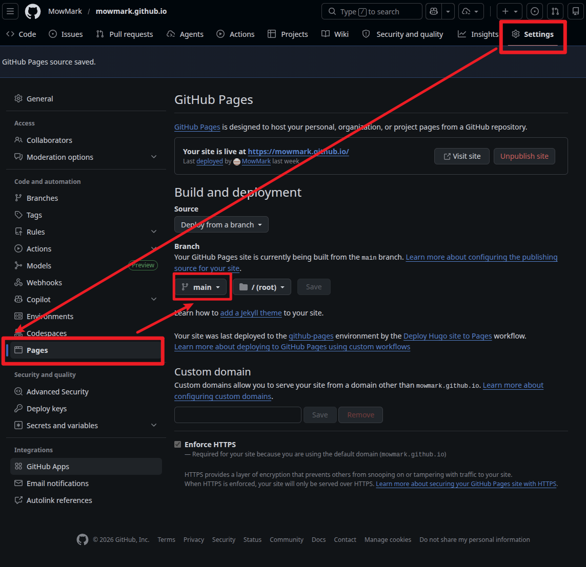

承接上一篇文章: **[使用Hugo创建个人博客](../000_HugoInit)**, 在本地搭建好环境后, 本文将告诉你如何将博客手动以及自动化发布到公网.

## 网络发布基础配置

想要将网站发布到公网, 需要满足三个条件: **代码托管平台, 服务器(托管服务)以及域名**.

出于性价比与便利性, 本文采用 **GitHub 仓库 + GitHub Pages (免费托管)** 的一站式方案, 并使用 GitHub 提供的免费域名.

> **补充信息**:
> 上面三个条件中, 代码托管平台有GitHub, GitLab和Gitee等平台, 域名可以从 GitHub, 腾讯云, 阿里云等平台获取, 而托管服务则可以由 GitHub Pages, Cloudflare Pages, 腾讯云和阿里云提供, 后两者用的人不多, 喜欢挑战自己的伙伴可以尝试部署一下.

### 创建 GitHub 仓库

首先, 登录你的 **[GitHub 官网](https://github.com)**, 新建一个仓库.

>这里有一个**相当重要的命名规则**:
>
> 1. 如果你希望博客最终的访问域名是简单的`https://<Your-UserName>.github.io`, 那么仓库的名称**必须**命名为`<Your-UserName>.github.io`.
> 2. 如果你随便起了个名字 (例如`my-blog`), 那后续的访问域名就会是`https://<Your-UserName>.github.io/my-blog`.



权限请务必选择 **Public(公开)**, 否则 GitHub Pages 无法免费提供服务. *更多信息可以查看 **[GitHub Pages 说明](https://githubdocs.cn/en/pages/getting-started-with-github-pages/what-is-github-pages)**.*

### 将本地代码推送到 GitHub

在上一篇文章中, 我们已经在本地项目目录执行过了 `git init`. 现在, 我们需要将本地内容推送到刚刚创建的 GitHub 远程仓库.

首先, 配置 Git 用户信息 (如果之前没配置好全局账号):

```bash
git config user.email <Your-EmailAddress>
git config user.name <Your-UserName>
```

> **提示**: 加上 `--global` 参数可以进行全局配置, 配置信息存放在 `~/.gitconfig` 文件里. 局部配置则存放在项目隐藏文件 `.git/config` 中.  

接下来, 将本地文件提交并推送到远程仓库:

```bash
# 在项目根目录下:
# 将所有文件加入暂存区并提交
git add .
git commit -m "Feat: 博客首次初始化"

# 关联远程仓库 (请将下面的链接替换为你的仓库地址)
git remote add origin https://github.com/<Your-UserName>/<Your-Repository>.git

# 将本地代码推送到远程仓库的 main 分支
git push -u origin main
```

> **提示**: 关于这个部分, 有非常多的教程会倾向于先在本地运行 `hugo` 命令生成静态网页 (放在 `public/` 目录下), 再把 `public` 文件夹 `push` 到 GitHub 仓库. 这种做法相当繁琐, 每次发布文章都需要本地编译.
> 所以这篇文章我们采用了另外一种做法: **将包含 `.md` 原稿的整个项目源码推送上去, 让 GitHub Actions 帮我们在云端自动部署并发布**.

## 部署博客网站

### 配置 GitHub Pages

进入 GitHub 仓库, 点击顶部的 **Settings**, 在左侧栏找到 **Pages**.

在 `Build and deployment`（构建和部署）板块下, 将 `Source` 的选项从默认的 `Deploy from a branch` 改为 **GitHub Actions**.



### 创建自动化部署工作流 (Workflow)

我们需要在项目根目录下创建一个特定的文件, 告诉 GitHub 每当有代码推送时该怎么做.

在项目根目录下执行:

```bash
vim .github/workflows/hugo.yaml
```

将以下 *[官方推荐的配置代码](https://hugo.opendocs.io/hosting-and-deployment/hosting-on-github/)* 粘贴到你的文件中, 根据需要更改分支名称和 Hugo 版本:

```YAML
# 自动将 Hugo 站点部署到 GitHub Pages 的示例工作流
name: Deploy Hugo site to Pages

on:
  push:
    branches:
      - main # 推送到 main 分支时出发

  workflow_dispatch: # 允许在 Actions 页面手动触发

permissions:
  contents: read
  pages: write
  id-token: write

concurrency:
  group: "pages"
  cancel-in-progress: false

defaults:
  run:
    shell: bash

jobs:
  build:
    runs-on: ubuntu-latest
    env:
      HUGO_VERSION: 0.141.0 # 建议填入本地使用的 Hugo 版本
    steps:
      - name: Install Hugo CLI
        run: |
          wget -O ${{ runner.temp }}/hugo.deb https://github.com/gohugoio/hugo/releases/download/v${HUGO_VERSION}/hugo_extended_${HUGO_VERSION}_linux-amd64.deb \
          && sudo dpkg -i ${{ runner.temp }}/hugo.deb
      - name: Install Dart Sass
        run: sudo snap install dart-sass
      - name: Checkout
        uses: actions/checkout@v4
        with:
          submodules: recursive # 确保拉取主题子模块
          fetch-depth: 0
      - name: Setup Pages
        id: pages
        uses: actions/configure-pages@v5
      - name: Install Node.js dependencies
        run: "[[ -f package-lock.json || -f npm-shrinkwrap.json ]] && npm ci || true"
      - name: Build with Hugo
        env:
          HUGO_CACHEDIR: ${{ runner.temp }}/hugo_cache
          HUGO_ENVIRONMENT: production
          TZ: America/Los_Angeles
        run: |
          hugo \
            --gc \
            --minify \
            --baseURL "${{ steps.pages.outputs.base_url }}/"
      - name: Upload artifact
        uses: actions/upload-pages-artifact@v3
        with:
          path: ./public

  # Deployment job
  deploy:
    environment:
      name: github-pages
      url: ${{ steps.deployment.outputs.page_url }}
    runs-on: ubuntu-latest
    needs: build
    steps:
      - name: Deploy to GitHub Pages
        id: deployment
        uses: actions/deploy-pages@v4
```

保存后, 将这个文件推送给 GitHub:

```bash
git add .
git commit -m "添加 GitHub Actions 部署脚本"
git push
```

推送完成后, 点击 GitHub 仓库顶部的 **Actions** 标签, 会看到一个正在转圈的任务, 等状态变成绿色的勾✅, 你的网站就已经成功发布到公网上了!

访问你的域名(`https://<Your-UserName>.github.io` 或者 `https://<Your-UserName>.github.io/<Your-Repository>`)看看吧!
